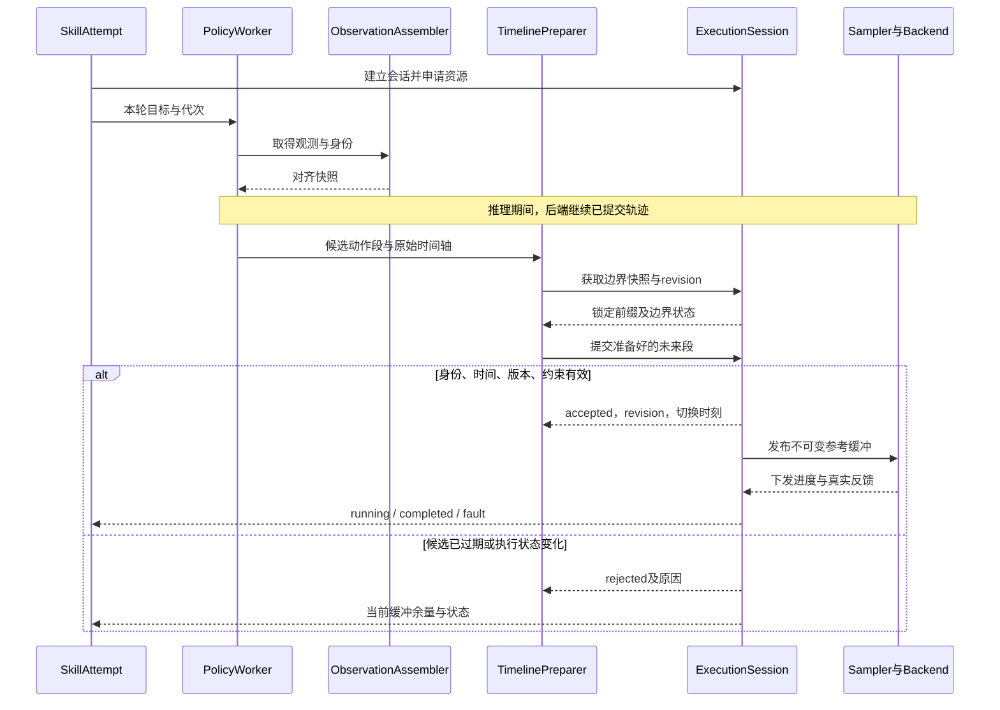

# 动作执行契约 v0.2

更新：2026-09-17。配套架构 v0.3 的建议草案；本文是执行语义的唯一维护处。v0.2 修正正常终点与断流、重定时权限、持物期间臂资源移交及停止包络。当前已生成首版 ROS 消息子集并完成模拟验证；完整契约尚未全部实现，硬件周期和阈值未实测。实现差异见[架构8.5.4](软件架构设计.md#854-当前代码组织与替换边界)。设计依据见 Galbot 对照（本地参考：`Galbot设计对照.md`，不随 Git 分发）与[总体架构](软件架构设计.md)。

## 1. 所有权与两个更新周期

**一个 ExecutionSession 只有一份权威动作时间轴，最终提交权属于本地执行端。** Policy worker、MoveIt、Servo 和遥操作生成候选，不能自行认定某个 chunk 已开始执行。动作预处理可以在独立线程/进程计算，最终提交时仍要核对执行端的真实时间轴版本。

角色：

- SkillAttempt：持有本轮技能目标、推理/感知请求、控制租约和取消状态。
- ActionAdapter：模型/规划动作的单位、坐标、维度与绝对/增量解码。
- TimelinePreparer：生成带 100 Hz 逻辑采样或可采样曲线的候选段，不直接写已执行历史。
- ExecutionSession：唯一提交者；校验租约和候选基线，返回 accepted/rejected/需重新准备。
- ReferenceSampler：按已提交时间映射读取参考，在后端周期推进；不自行更改轨迹时间，不做网络推理、路径搜索或写盘。
- CommandRouter：将已授权命令路由至具名设备组，不负责插值或厂商协议。
- DeviceDriver：关节、灵巧手与底盘分别对接已有控制器，声明命令接纳、设备状态和停止能力。
- FeedbackCollector：汇总各驱动的独立采样时间和实测；不能把新鲜设备的时间戳覆盖失联设备。具体拆分见[架构8.5.5](软件架构设计.md#855-设备接入拆分与历史代码落点)。

HeldObjectSession 是执行会话的一种持续保持用途：抓取后经确认接管灵巧手/必要资源，跨越导航和任务终态存在，直到显式释放/移交。其保持授权不随普通策略租约退出被误撤销；Supervisor/后端持续监督反馈，实际故障时返回明确未知或失败。任意模型不能借此持续控制其他资源。

保持责任与资源写权限分开：手可持续由持物会话控制；手臂需要抬升、转运输姿态、放下时，由该会话受控执行或显式移交给新的操作会话，同时保留持物监测。移交原子更新本地 Owner 表且有确认，不产生两个手臂写入者。持物会话是长寿命状态对象，首期不要求独立进程。

100 Hz 为逻辑参考时间间隔 10 ms，不强制每点一条消息。有限规划轨迹可保留原时间戳及有效导数，由单一插值负责人采样，不先降为只有位置的 100 Hz 点列再重复拟合。实际驱动周期通过 BackendCapabilities 返回；能力不足时显式报告缺口。

## 2. 输入模式必须显式选择

| 模式 | 含义 | 替换与缺失规则 |
|---|---|---|
| FiniteTrajectory | 已知完整路径及结束条件 | 一次接受；按合同完成或取消；不可把缺段当作正常完成 |
| JointReferenceSegment | 带绝对时间或锚点的一段未来关节参考 | 替换允许变化的未来后缀或追加；重传去重；不能改已经执行/锁定部分 |
| JointTargetUpdate | 持续到来的关节即时目标 | 执行层按限值生成过渡；丢包可用下一有效目标覆盖；不保证逐点经过每个输入 |
| BaseVelocityUpdate | 本体允许的移动速度目标 | 独立速度合同、短有效期和超时动作；不转换为手臂位置向量 |

当前 Python 模拟执行子集共用 `bindu_execution/interpolation.py`，具体行为如下（不是全部目标架构的验收声明）：

- **在线 `joint_target`**：目标时间戳及有效期沿用来源；目标时间到达后，从当前参考 q/dq/ddq 生成同步多轴五次曲线。相同目标仅延续有效期，不反复重新起步；换向必要时先减去当前速度再接目标。在线目标允许调整过渡时长，但不承诺逐点到达。VR 与 Pi 共用此入口，IK 连续性代价仍保留在求解器中。
- **有限 `finite_trajectory`**：`stamp + offsets` 固定执行时间；位置、速度和加速度共同定义分段五次 Hermite 路径。未提供的速度/加速度按零端点导数解释，因此位置点列默认逐点停稳；不能把需要连续通过的 100 Hz 点列丢掉导数后发送。终点必须静止，时间过短或整段约束不通过则拒绝，不暗中重定时。任意其他规划曲线需要先显式转换为该表示，不能声称保留未传递的路径信息。
- **动作块 `joint_reference_segment`**：必须提交当前 `expected_revision`；过期前缀删除，第一未来结点从提交时的当前参考状态接续，后续结点时间和导数保持。接续曲线不满足约束则整体拒绝，原时间轴不受影响。接受后返回 `revision` 和 `switch_stamp`；当前串行模拟后端没有不可撤销硬件队列前缀，切换边界为执行线程处理时刻与未来 `stamp` 的较晚者。不是完整异步 proposal/prepare/commit 协议。
- **块末尾**：提交前验证内部减速尾段，即使末点速度非零也不依赖下一块必定到达。没有新块接续时进入 `STOPPING / BUFFER_EXHAUSTED`，停稳后失败结束，不能把末点发布误报为正常任务完成。正常有限轨迹仍以实测位置达到容差后成功。
- **约束与周期**：q、dq、ddq、jerk 来自同一多项式；用 Bernstein 控制点凸包及有界细分检查整个时间区间，允许约 1e-9 的浮点容差，可能保守拒绝。profile 的 `execution` 配置给出加速度、jerk、采样周期、周期超时、停止确认时限和在线过渡最长时间；`joint_dynamics` 可覆盖各关节速度/加速度/jerk。旧模拟 profile 缺失字段时兼容默认 20 rad/s²、400 rad/s³、10 ms、100 ms、5 s、30 s；这些都是仿真值，不是硬件标定。速度仍以 `max_speed` 为默认。驱动只接受参考，模拟跟踪速度限制不代替执行层约束。
- **停止与换控制源**：取消、正常租约到期、目标断流生成受约束减速；`STOPPING` 禁止新普通命令。释放立即撤销旧租约，停止由执行器内部继续负责；参考终点及新鲜反馈确认后才清除参考并允许新租约。当前采用停稳后切换控制源，同一租约内同组命令可连续接续，跨组运动需显式停止；运动中的租约移交和多组并发未实现。`hold` 不发送开手目标，完整持物授权仍待实现。
- **异常**：反馈失效、驱动拒绝、时钟回退、调度间隔超过 `max_tick_gap`，或减速曲线无法认证时调用设备停止并明确报告原因；不承诺这种故障下仍平滑。不能在长调度空档后直接跳到最新轨迹采样。停止服务回执只表示请求已受理，客户端必须继续等待 `STOPPING` 结束和新鲜静止反馈。
- **状态可观测性**：`ExecutionState.reference` 提供位置/速度，平行的 `reference_accelerations`、`reference_jerks` 与 `reference.name` 同序，`revision` 标识已提交时间轴。它们是执行参考，不是实测动力学量；实测位置与参考分开记录。

历史 C++ 内核保留为只读对照，尚未接入生产执行链；其固定周期在线跟随计算更快。本轮离线对照中，新曲线方案的正弦跟随误差约为原内核两倍，代价是更保守的完整过渡和停稳策略；不能据此认定已满足 VR 低延迟或 Orin 硬实时要求。复现工具见 README，ROS 和真机验收状态以实际测试记录为准。

优化后的 C++ `experimental/AdaptiveStream` 也尚未接入运行链，只实现单轴即时位置目标、可变采样间隔、TTL 和停止。无指定到达时间的单点运动与位置流可以共用该入口，但 `valid_until` 仅是有效期，不是到达时刻；`stopped()` 不表示真实设备到达。该类没有未来轨迹队列、速度/加速度目标、动作块 revision、关节组同步或反馈完成接口，不能直接承接上表所有模式。多个独立实例也不保证同时到达。完整接入必须保留现有执行层的时间轴、模式接续和反馈语义，再复用候选的在线跟随计算；不能把轨迹所有点连续调用 `target()` 当成动作块支持。

规划/VLA 输出“应逐点跟随的未来轨迹”不能误标为覆盖式即时目标。SDK 只有位置接口并不决定上层输入模式，适配层负责补齐获准参考到即时硬件目标的采样。

## 3. 最小字段与不变量

通用字段：schema_version、run_id、attempt_id、producer_instance_id、lease_id、epoch、command_id、sequence、resource_group、robot_profile_hash、config_generation。

段模式字段：observation_id/request_id（适用时）、clock_domain、anchor_time、sample_offsets 或曲线时间、joint_names、positions、可选 velocities/accelerations、valid_until、source_semantics、base_timeline_revision、replace_from、path_constraint_id、retime_policy。

结束与容差字段：end_of_stream/final_segment、terminal_state、goal_tolerance、goal_time_tolerance；字段应用于明确的输入模式。测量速度/加速度不可得时，使用带估计来源与误差界的状态或拒绝依赖该状态的行为，不能默认填零。

即时目标字段：source_time、valid_until、joint_names/命名移动分量、目标值、允许过渡时间/误差。两种模式不共用含糊的“timestamp”解释。

必须检查：

1. 向量维度与关节名一致，值有限、单位明确、时间单调、采样间隔为正、所控资源在租约内。
2. 绝对/增量动作在解码阶段统一；保留来源语义，不在下层猜测。
3. 版本、代次、producer 和配置匹配；新的 command_id 不掩盖旧观测或旧 timeline revision。
4. 已过期、时钟未知或需要未来外推却未获准的候选拒绝。
5. 未控关节不补零；仅对已拥有资源指定 `hold_at_acquire` 等明确保持策略，其余资源保留其现有 Owner。
6. joint_names 相同不等于约束相同；几何/工具/标定变更使相关路径验证失效。

### 3.1 灵巧手与臂手协同补充（2026-09-15）

- 手部动作的 `source_semantics` 区分关节位置、驱动量、手型/协同参数。解码引用 hand_profile_hash 与 mapping_version，记录耦合展开结果；不可控/被动关节不伪装成独立目标。
- 状态显式标记测量、估计、不可用及各自时间；不能以命令回显构造实际手指位置，电流也不能直接当作接触力。
- 臂手联合候选包含命名资源集、共同执行时间、各后端能力和阶段依赖。100 Hz 是统一逻辑参考；手部下发/插值按声明能力处理，记录时间偏差。不能把超出手部硬件带宽的目标静默丢弃后报告逐点执行完成。
- 联合命令有各后端的接纳/下发/实测状态。软件统一接纳不承诺跨设备事务原子性；部分接纳需触发预先定义的中止/保持，不能将整组报告为成功。
- 手指接触闭合阶段不得沿用自由空间任意平滑/重定时；阶段合同须约束行程、速率、允许过渡、反馈条件与超时。模板/模型给出的“抓住”只是提议，HeldObjectSession 由技能验收后移交。

## 4. Chunk 时间处理与原子提交

### 4.1 时间语义

模型返回的第 i 个动作对应 `t_i = anchor_time + offset_i`。anchor 来自模型契约：图像时刻、请求时刻或明确指定执行起点，不默认“收到响应时”。观测年龄限制与轨迹有效期是两个参数；一段正常未来动作不因原始图像随后变老就自动无效，执行中仍需新鲜硬件反馈和技能约定的环境有效性。

候选接入时读取后端的 `now`、执行轨迹版本和锁定边界。确定切换时间 `t_switch`，晚于后端已不可撤销的前缀以及必要的过渡准备时间。`t_switch` 之前仍使用已接受旧轨迹；候选过期前段裁掉，剩余段不足以接续/收敛则拒绝。

不要将所有晚到动作简单整体右移为“从现在开始”。只有允许重定时且环境/动作语义仍有效时才可移动时间轴，同时记录偏移。

### 4.2 单次提交过程

1. 获取执行快照：revision、锁定前缀结束时刻、预测边界状态 q/dq/ddq、当前真实反馈及其年龄。
2. 工作线程完成候选衔接、限值/路径检查和必要的停止尾段；标注使用的快照版本。
3. 执行端在有界的提交步骤中复核 lease/epoch、revision、时限和所依赖的约束/场景版本；若准备期间状态已失配，拒绝或要求重新准备，不无限阻塞周期线程。只核对本段依赖的对象/碰撞配置，不能因无关对象更新而无限拒绝；相关动态障碍失效由环境检查触发停止或重规划。
4. 用不可变缓冲替换允许修改的未来后缀，原子发布新 revision，返回准确的接入时间和接纳范围。
5. 采样器在 `t_switch` 前继续旧段，此后读取已提交段；记录实际下发与真实反馈。

缓冲交换的内存分配/回收在非周期路径管理。实时线程不等待推理、碰撞规划或动态内存释放。

### 4.3 重定时与插值的权限

自适应过渡/变速若改变已接纳目标的执行时刻或几何路径，必须由 ExecutionSession 接纳新 revision、更新未来时间映射，并反馈实际生效边界。旧 revision 的在途 VLA chunk 按新边界重验或拒绝；规划 Action 的允许时长和阶段超时同样需要协调，不能只延长底层时钟。ReferenceSampler 仅按已批准曲线插值，不能暗中减慢推进速度。

停止管理可因局部故障立即触发预授权的停止/保持，不等待网络提交；触发时使旧普通轨迹失效并生成新的执行状态/版本，不能继续向策略报告原动作仍按原时刻执行。硬件控制器若有不可观测的内部平滑/排队，则其锁定前缀和边界状态只能按实测能力描述，不能承诺精确在线拼接或 RTC。

### 4.4 RTC 的边界（后续可选能力）

只有模型服务端声明支持相应 RTC 契约时才启用。传给模型的前缀必须对应执行端已接受/锁定的轨迹，附 revision、时间和状态来源；不能使用未被接受的上一次模型输出充当前缀。响应回来后仍要检查当前 revision/epoch。RTC 不取代控制端的取消、超时和连续性校验。

## 5. 执行与推理异步时序

## 6. 执行状态与停止

| 状态 | 进入条件 | 处理/退出 |
|---|---|---|
| IDLE | 没有活动轨迹 | 获准会话进入 ARMED |
| ARMED | 配置、资源、反馈等前提成立 | 接受首段后进入 RUNNING；仅准备不产生动作 |
| RUNNING | 存在有效且可执行的参考 | 正常采样/补段；正常终点经容差验收后报告 completed 并进入 HELD；错误触发停止/故障 |
| STOPPING | 取消、有效轨迹不足或可恢复错误 | 禁用普通动作提议，执行已验证的停止轨迹或硬件规定行为 |
| HELD | 已确认停止并保持必要资源 | 可按合同结束、移交或进入单独 recovery；不等于自动释放灵巧手 |
| FAULT | 反馈/驱动/停止结果异常或未知 | 禁止自动恢复动作，明确 physical state unknown 等结果 |

**正常结束和断流分别处理：**

- FiniteTrajectory 或带明确结束标记的最后一段：允许执行已经验证的终端减速段；到达终点后按位置/速度容差和允许完成时间验收，再保持。不能仅因剩余时间变短就提前把正常轨迹截断。
- 尚期待后续输入的流：`buffer_remaining <= required_stop_horizon + guard` 时进入停止准备。所需时间包含当前状态制动、SDK 不可撤销前缀、通信/调度余量；阈值待实测。
- 即时关节目标与底盘速度：按命令有效期及模式 watchdog 收敛；它们没有可直接套用的有限轨迹完成语义。

**停止轨迹也有几何约束：** 限速/限 jerk 不自动保证避障、保持接触或不掉物。自由空间运动需验证允许制动包络；接触闭合、持物和受限撤离使用各阶段合同。若可达停距/停止尾段无法满足环境约束，应在接纳或推进前拒绝/限制动作。设备故障可能只能执行硬件停止，不能承诺始终平滑或永不掉物。

停止意图区分：

- `drain`：不接收新任务，当前技能在约定阶段边界结束，仍遵守最大时长。
- `cancel`：撤销普通生产者输入权限，执行器保留受监督的停止权限；已持物按已核实的后端能力保持，不自动张手。
- `shutdown`：先取消并确认物理收敛，再停止依赖服务；停止失败记录异常，不能仅关进程后报告已停止。
- 硬件急停/故障：保留其独立机制与真实结果，不以软件命令代替硬件状态。

若技能取消后需要撤离等动作，必须申请限于资源、动作范围和截止时间的 RecoveryPermit，由当前 SkillAttempt 负责并明确记录。普通模型/VLA 输入仍无权继续；无法证明前提时不启动恢复。新任务只有在旧资源已收敛或被明确移交后才能接管。

## 7. 反馈和幂等性

- received：本地收到，不代表校验通过。
- accepted：本地执行端已接纳时间轴，不等于驱动器接受。
- dispatched：指令已交给 SDK/传输，记录返回证据。
- controller_accepted：仅在下层有明确确认时报告，否则为 unknown/not_available。
- running/completed/stopped：依据真实状态及合同判定；仅有下发计数不能报告物理到位。

同一 command_id 的重传返回已有结果，不再次执行。命令序号/来源覆盖范围按会话记录。driver restart、ROS time reset、attempt cancel 都使相关生产者代次失效；恢复通信不自动恢复执行。

## 8. 验证样例与预期结果

| 输入事件 | 必须满足的结果 |
|---|---|
| 正常 chunk 到达且旧轨迹仍在执行 | 旧前缀不变，在确定边界接续，返回实际接入范围 |
| 新 chunk 全部过期 | 拒绝；依旧缓冲决定继续或停止，不整体偷移时间轴 |
| 准备期间执行版本改变 | 拒绝陈旧候选并有限重试；不污染当前缓冲 |
| 取消后模型迟到 | 拒绝旧 epoch；停止/保持执行仍有合法内部权限 |
| 持物证据缺失或实际停止未确认 | 结果标未知；不报告已安全收敛，也不启动下个普通任务 |
| 同一动作重传 | 返回原结果，不触发第二次物理动作 |
| 反馈超时但指令仍在发 | 进入定义的停止/故障路径，反馈与下发健康分开 |
| 磁盘记录失败 | 上报 Evidence 不完整；不重新执行已经完成的抓取 |
| 有限轨迹进入最后的正常减速段 | 不误判断流；按终点容差和完成时限验收 |
| 自适应重定时后旧 revision 的 chunk 到达 | 按新边界重验或拒绝；反馈包含新的生效时间 |
| 已持物后请求手臂运输运动 | 有确认地移交臂写权限，手部保持与持物监测不中断 |
| 减速曲线满足导数约束但超出允许空间 | 不把它当作合格停止路径；执行阶段约定的处置 |

本表是设计走查，不是已通过的测试。下一步需用模拟后端实现故障注入，并按真实硬件补齐周期、缓存及停止能力。
