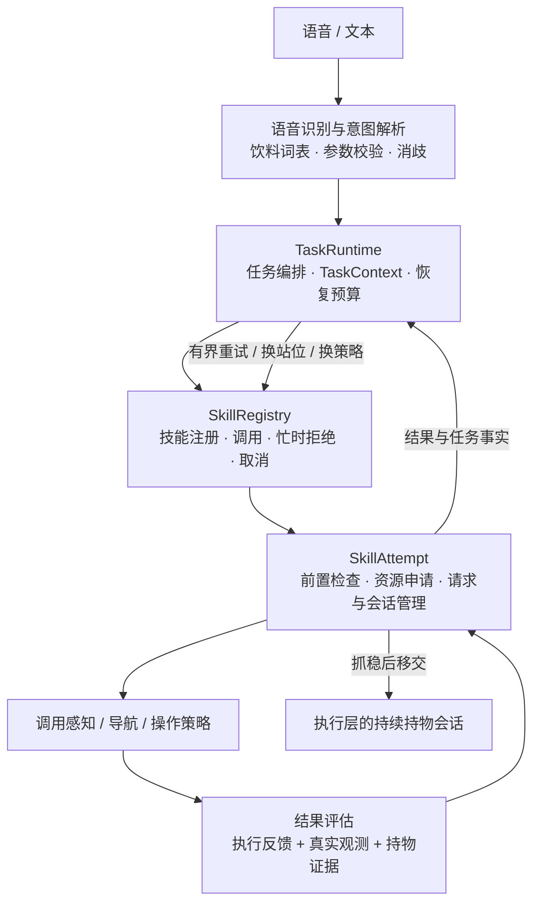
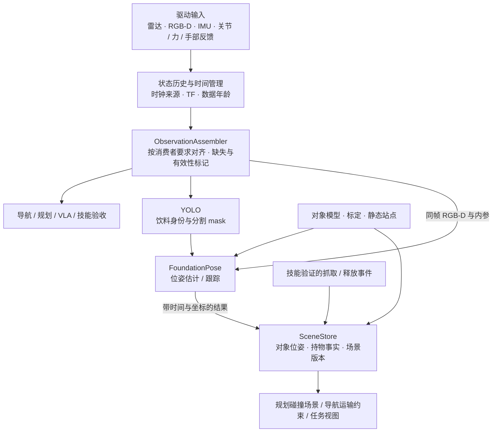
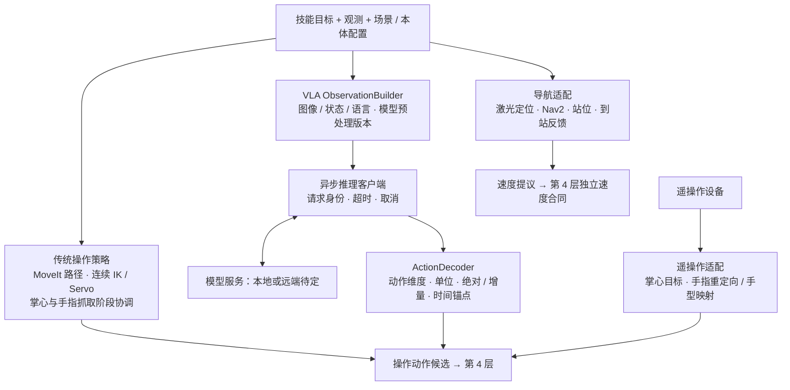
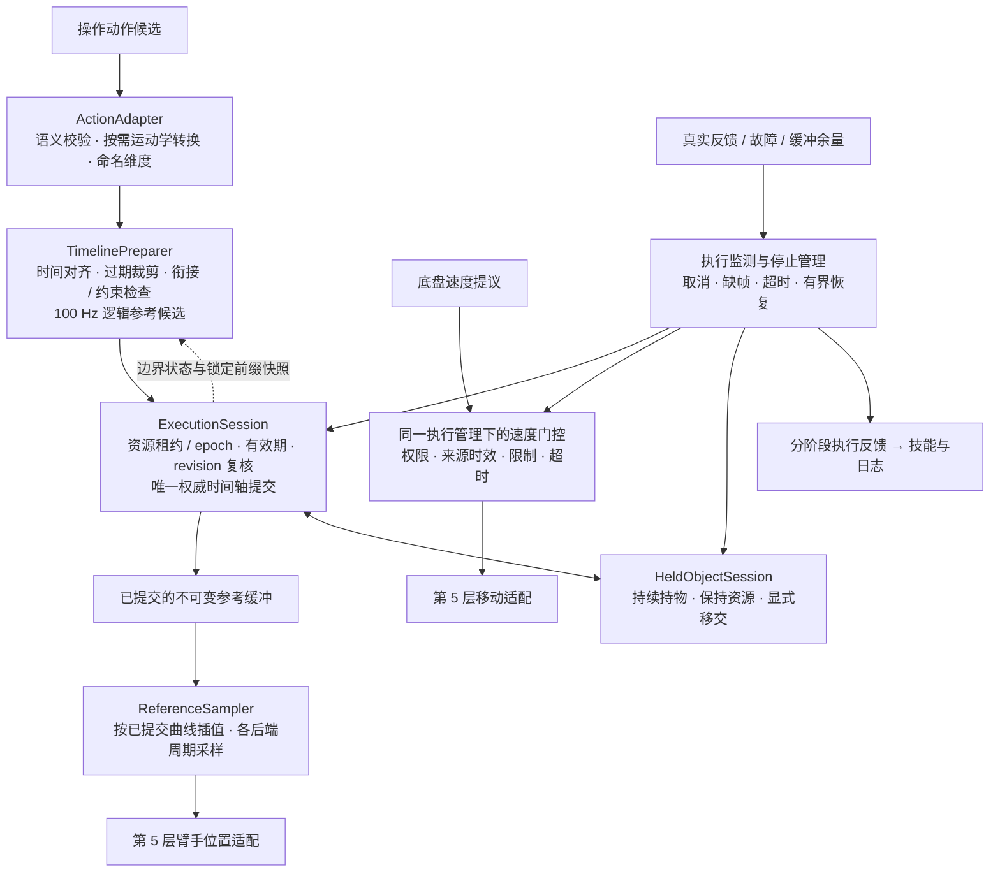
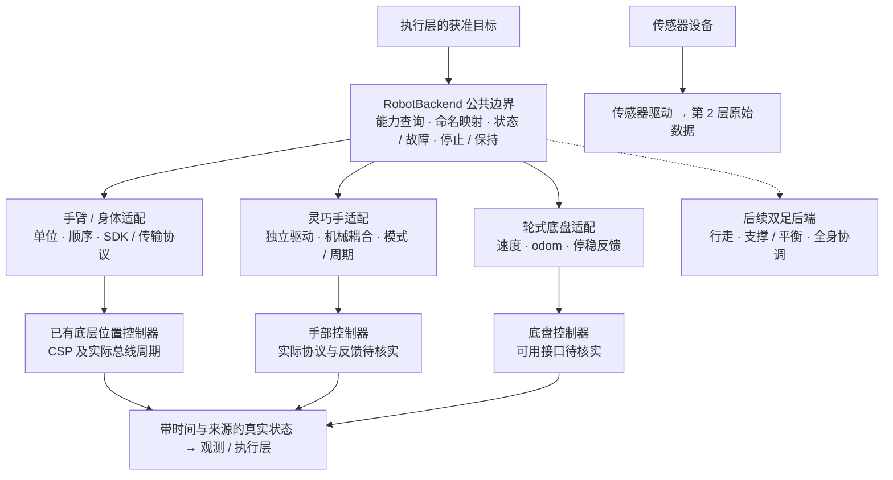
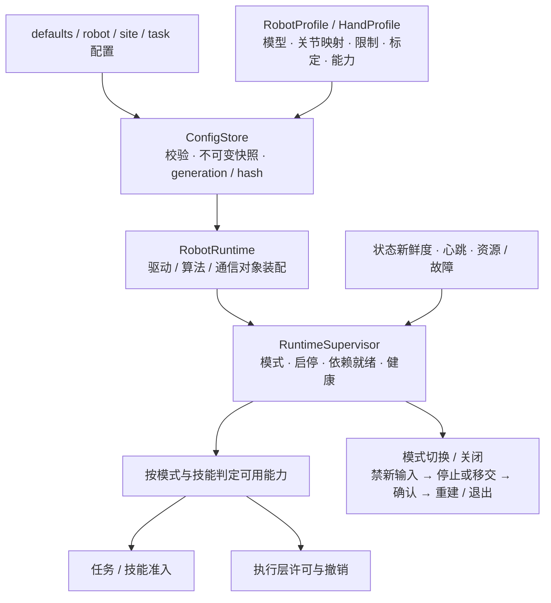
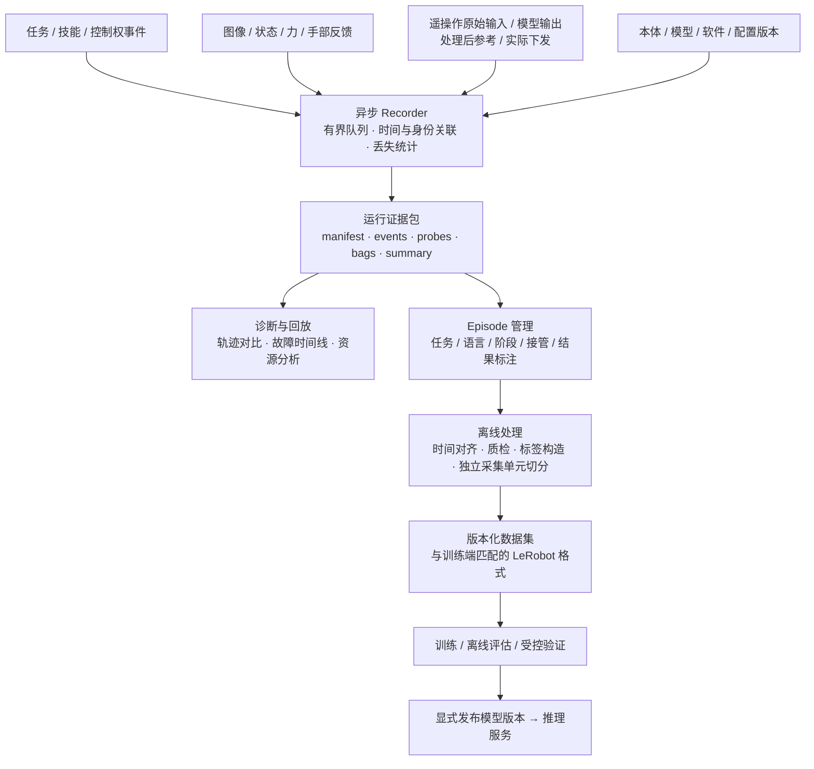

# Bindu 各层架构图

更新：2026-09-16。本文保留七类职责组的图示，辅助阅读[架构 v0.3](软件架构设计.md)；不是七层串行部署或另一份接口规范。执行规则以[契约 v0.2](动作执行契约.md)为准。

沿用详细视图的七个编号。第 2 组为共享观测服务，第 6、7 组贯穿系统，不表示所有请求必须逐层穿过七个节点。图中外部输入/输出节点仅标明接口，不属于该层实现。开源项目名称沿用现有候选，不新增版本或性能承诺。

## 1. 任务与技能：决定做什么、何时算完成

**读图：** 首期可用显式任务状态机；SkillAttempt 管一轮请求与物理收敛。所有权详见架构第 3/6 节。

## 2. 观测与环境：提供同一时间语义下的可信输入

**读图：** 关节历史与图像采样时间关联；物体位姿及持物事实按来源维护。详见架构第 3/5 节。

## 3. 导航与操作策略：生成候选动作

**读图：** 策略只生成候选；规划、VLA 与遥操作复用同一执行入口。候选组件和版本依据见建设计划。

## 4. 统一执行：决定谁能动、何时动、如何收敛

**读图：** 正常终点与断流分开，变速要更新权威时间轴；首期后端选择见架构 7.2，完整规则见执行契约。

## 5. 硬件适配：隔离不同机器人与设备协议

**读图：** 同一资源选定一个实际后端；手臂/手周期分别声明。图中的抽象接口不等于强制新增进程。

## 6. 公共运行支撑：配置、模式、能力与生命周期

**读图：** 模式和能力按技能判定；控制周期不等待运行监督。配置与部署详见架构第 8 节。

## 7. 日志与数据：运行可诊断，示教可训练

**读图：** 记录输入、处理后参考、下发和实测的区别；采集 profile 与数据语义见架构第 9 节。

## 8. 与六层总图的映射

| 本文职责组 | 六层总图归属 |
|---|---|
| 1 任务与技能 | 应用交互层＋任务技能层 |
| 2 观测环境、3 导航操作策略 | 算法能力层；观测数据可直接到消费者 |
| 4 统一执行 | 控制执行层 |
| 5 硬件适配 | 驱动适配层及硬件边界 |
| 6 公共运行、7 日志数据 | 跨层公共平台 |

逻辑角色可以是类/库，不按图中数量创建节点或包。首期装配以[架构第 11 节](软件架构设计.md)为准。
