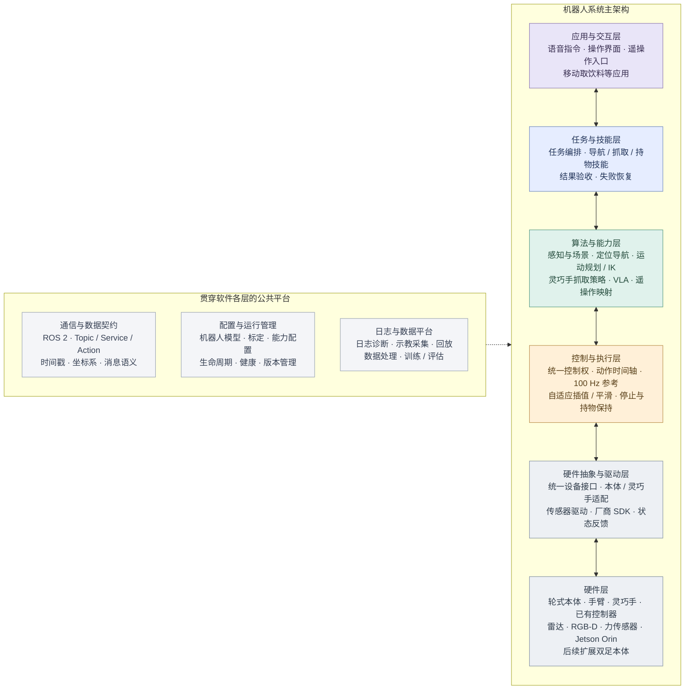
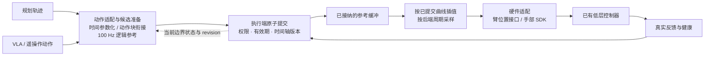
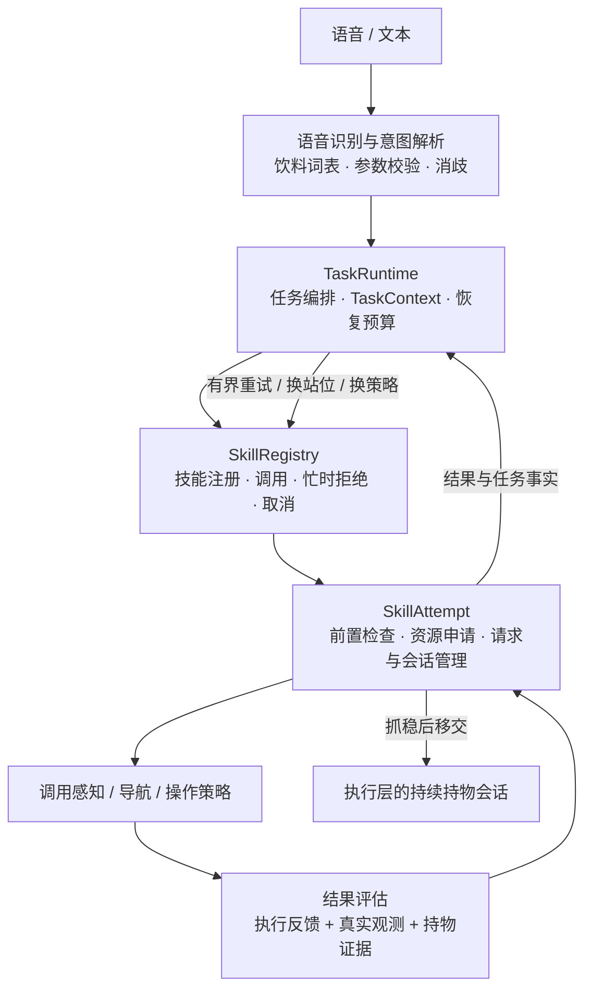
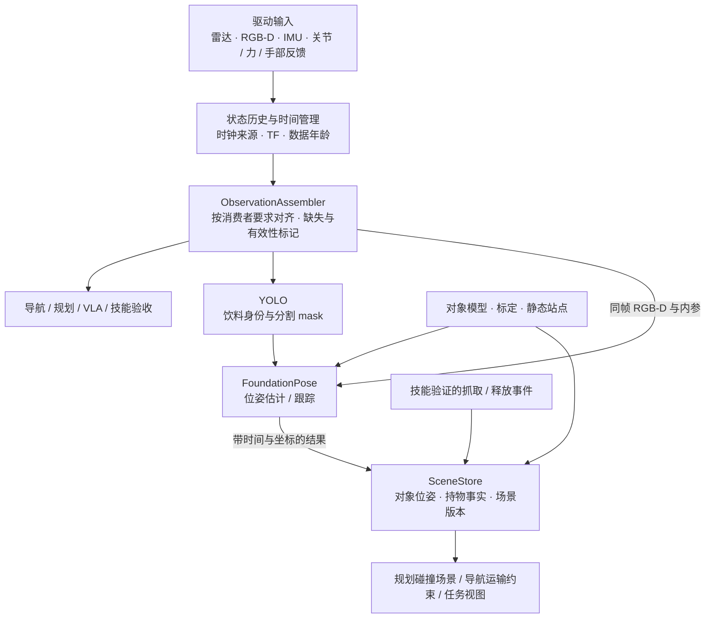
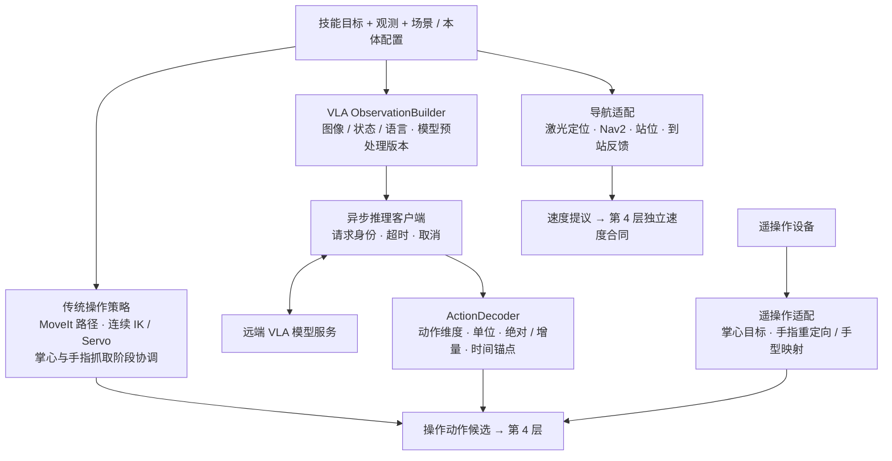
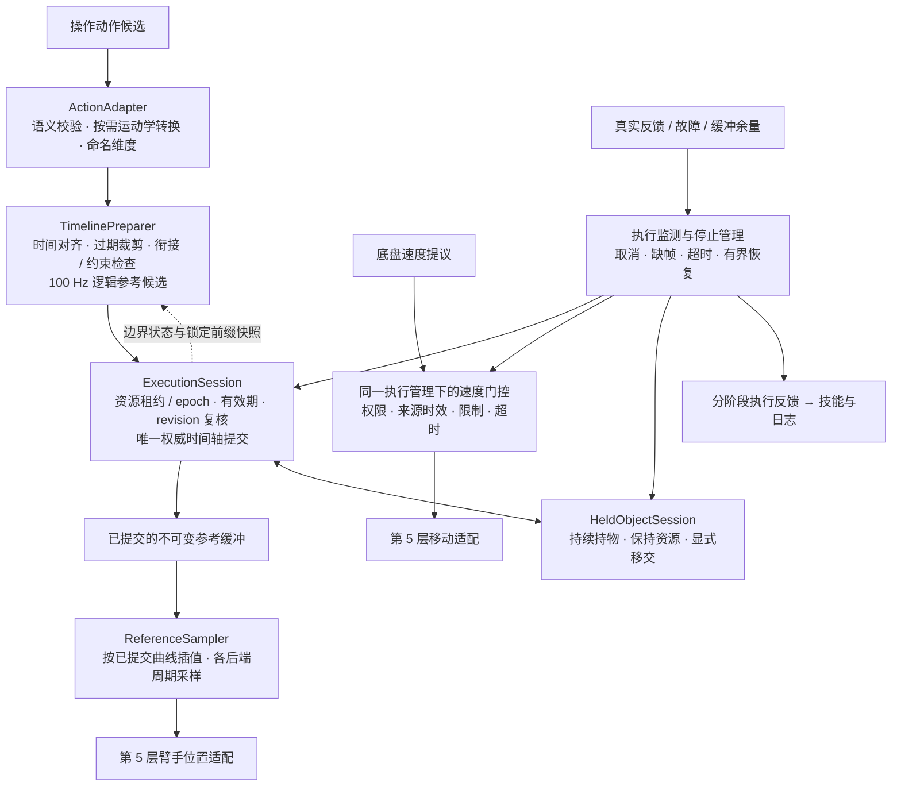
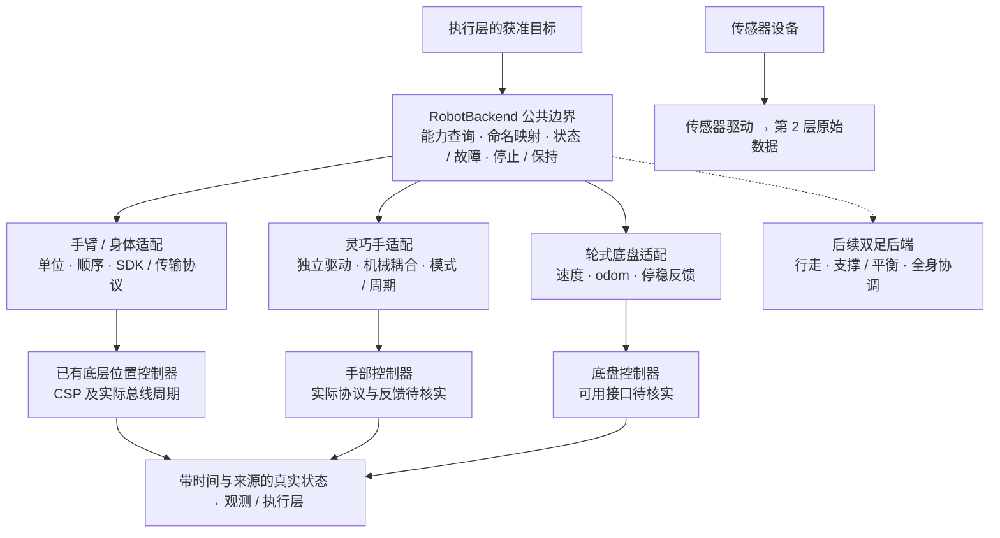
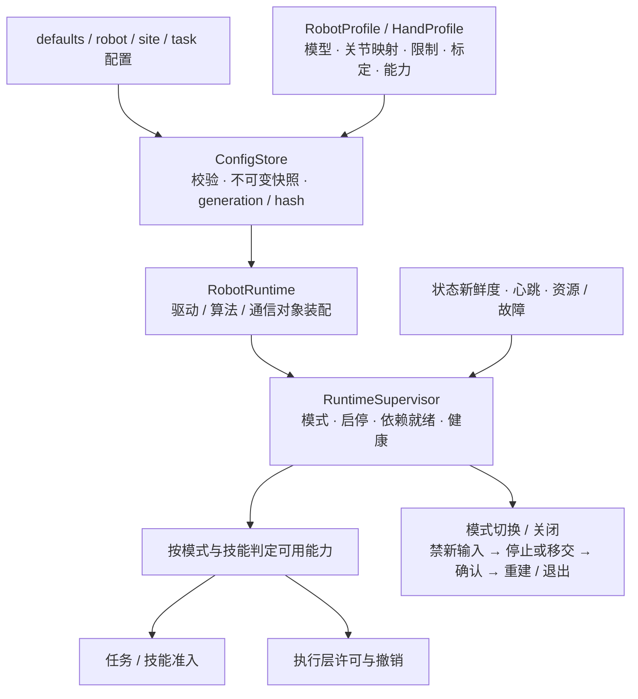
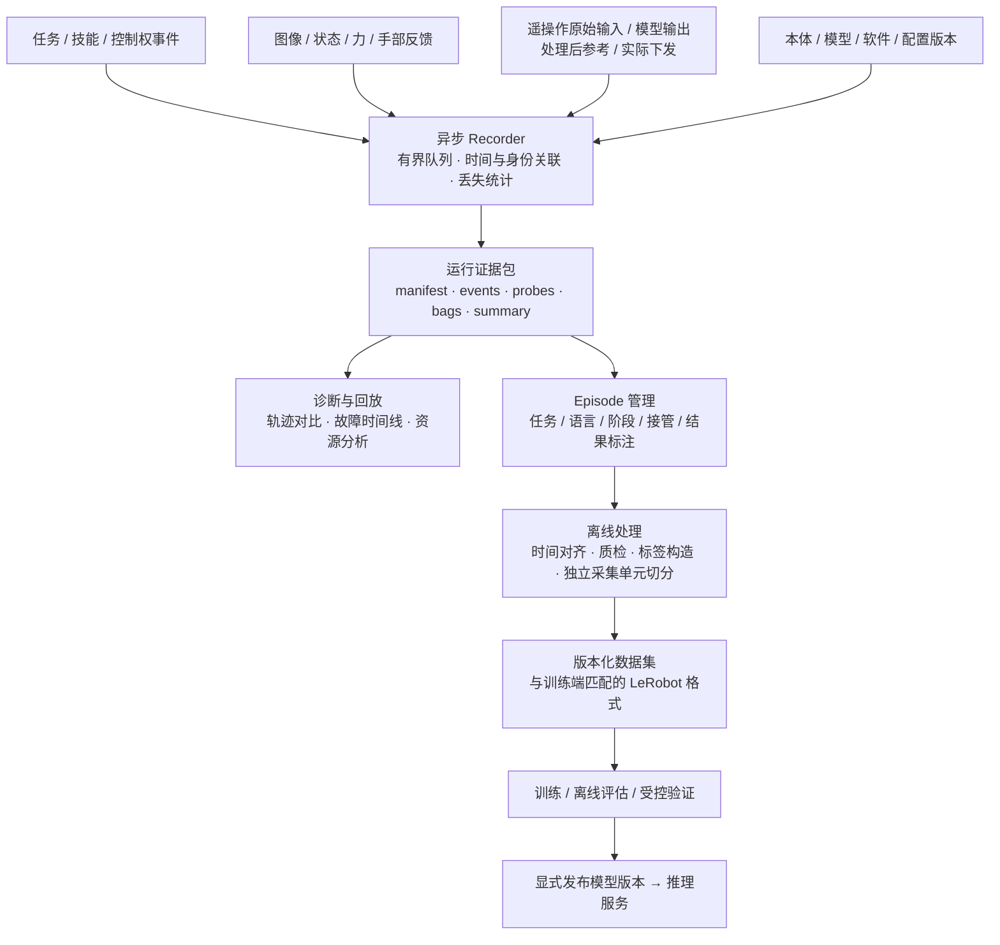

# Bindu 系统架构图

日期：2026-09-16。基于[软件架构 v0.3](软件架构设计.md)、[动作执行契约](动作执行契约.md)与灵巧手补充绘制。状态：建议架构的可视化，非已实现系统；开源项目名沿用[建设计划](一期建设计划与开源选型.md)的候选，不表示已经部署。

本图册集中维护总体分层、模块关系、执行链和[七类职责展开](#4-各层职责展开)，各视图共用架构与执行契约中的定义。

## 0. 总体分层架构

科研汇报用静态图片：[总体架构图 PNG](图片/总体架构图-科研版-v1.png)；[生成记录](图片/总体架构图-科研版-v1-提示词.md)。

本图以“硬件 → 驱动适配 → 控制执行 → 算法能力 → 任务技能 → 应用”六层概括整个系统，公共平台贯穿软件各层。它是同一架构的高层视图，不替代后文模块关系图，也不沿用细节图的七个职责编号。

读图说明：

- 上层表达任务与目标，下层落实运动与设备访问，真实状态向上反馈。箭头表示层次依赖与反馈，不要求感知数据绕经执行层逐级转发；观测可从驱动直接提供给算法和验收。
- ROS 2 是软件模块通信基础，不是硬件控制总线，也不是高频循环必须穿过的中心服务。
- 硬件抽象层通过统一接口承接不同本体；控制、算法和技能仍会依据能力/约束配置进行适配。双足后续还涉及稳定性与全身协调。
- 100 Hz 为上层关节逻辑参考；底盘速度独立处理，手臂与灵巧手的实际周期、反馈和插值能力分别核实。底层关节控制由已有控制器承担。
- 本图概括建设目标，不表示所有模块已经具备；实现与验证见[当前进度](当前进度.md)，已有条件和未知输入见[项目上下文](项目上下文.md)。

## 1. 系统总览

实线表示主要调用或数据流；虚线表示公共支撑、旁路记录或后续扩展。箭头是逻辑关系，不限定 ROS 节点、进程或机器数量。图中省略部分返回箭头；技能终态必须基于真实状态和结果验收。

图示仅表示调用/数据关系，执行状态、重定时、持物移交等规则以[执行契约](动作执行契约.md)为准；首期实现选择见[架构 7.2](软件架构设计.md)。

## 2. 执行链放大图

此图解释总览中最容易混淆的 100 Hz、插值与控制器边界。

- 总线周期归实际持有控制器/总线的一端；若现有控制器已完成插值，则采样/适配按其合同安排，不能叠加两个彼此未知的平滑器。
- 速度、加速度、jerk、路径偏差与接触阶段约束由具体合同定义；能力/约束不满足时拒绝或显式重定时，不能用平滑掩盖。
- 提交成功、SDK 下发成功、控制器接受、物理动作完成分别记录；缺少真实反馈时不能宣称闭环验收通过。
- 臂手共享时间与阶段语义，不默认物理同步；多个后端部分拒绝时有明确停止/保持流程。

## 3. 部署与实现

本图表示完整目标能力，不表示首期要同时部署所有模块。执行、任务、记录职责及上游组件的装配见[架构第 8/11 节](软件架构设计.md)；开发阶段见[建设计划](一期建设计划与开源选型.md)。

## 4. 各层职责展开

更新：2026-09-16。本文保留七类职责组的图示，辅助阅读[架构 v0.3](软件架构设计.md)；不是七层串行部署或另一份接口规范。执行规则以[契约 v0.2](动作执行契约.md)为准。

沿用详细视图的七个编号。第 2 组为共享观测服务，第 6、7 组贯穿系统，不表示所有请求必须逐层穿过七个节点。图中外部输入/输出节点仅标明接口，不属于该层实现。开源项目名称沿用现有候选，不新增版本或性能承诺。

### 1. 任务与技能：决定做什么、何时算完成

**读图：** 首期可用显式任务状态机；SkillAttempt 管一轮请求与物理收敛。所有权详见架构第 3/6 节。

### 2. 观测与环境：提供同一时间语义下的可信输入

**读图：** 关节历史与图像采样时间关联；物体位姿及持物事实按来源维护。详见架构第 3/5 节。

### 3. 导航与操作策略：生成候选动作

**读图：** 策略只生成候选；规划、VLA 与遥操作复用同一执行入口。候选组件和版本依据见建设计划。

### 4. 统一执行：决定谁能动、何时动、如何收敛

**读图：** 正常终点与断流分开，变速要更新权威时间轴；首期后端选择见架构 7.2，完整规则见执行契约。

### 5. 硬件适配：隔离不同机器人与设备协议

**读图：** 同一资源选定一个实际后端；手臂/手周期分别声明。图中的抽象接口不等于强制新增进程。

### 6. 公共运行支撑：配置、模式、能力与生命周期

**读图：** 模式和能力按技能判定；控制周期不等待运行监督。配置与部署详见架构第 8 节。

### 7. 日志与数据：运行可诊断，示教可训练

**读图：** 记录输入、处理后参考、下发和实测的区别；采集 profile 与数据语义见架构第 9 节。

### 8. 与六层总图的映射

| 本文职责组 | 六层总图归属 |
|---|---|
| 1 任务与技能 | 应用交互层＋任务技能层 |
| 2 观测环境、3 导航操作策略 | 算法能力层；观测数据可直接到消费者 |
| 4 统一执行 | 控制执行层 |
| 5 硬件适配 | 驱动适配层及硬件边界 |
| 6 公共运行、7 日志数据 | 跨层公共平台 |

逻辑角色可以是类/库，不按图中数量创建节点或包。首期装配以[架构第 11 节](软件架构设计.md)为准。
